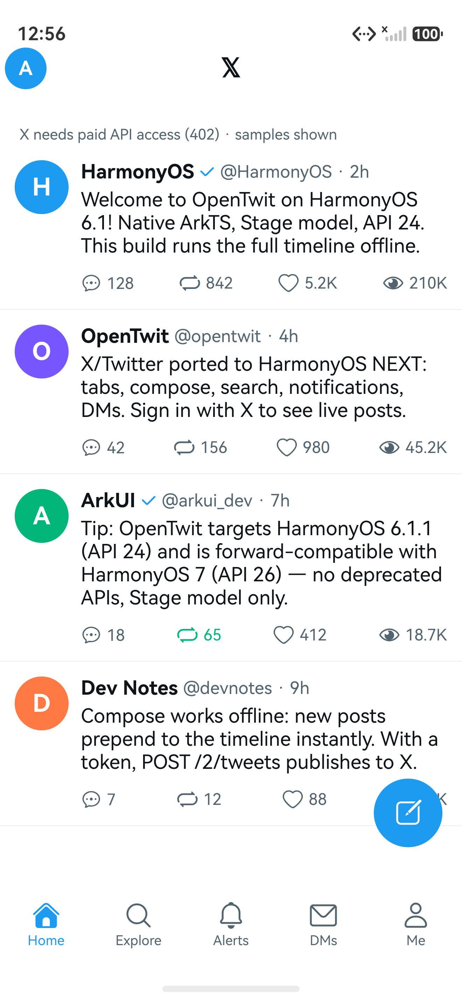
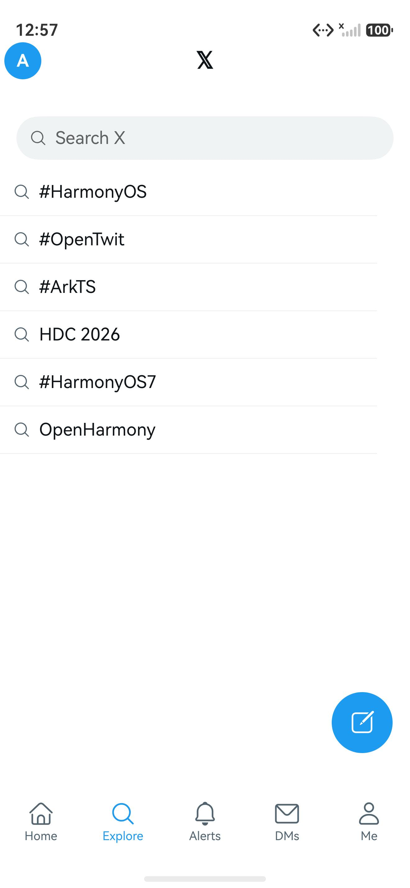
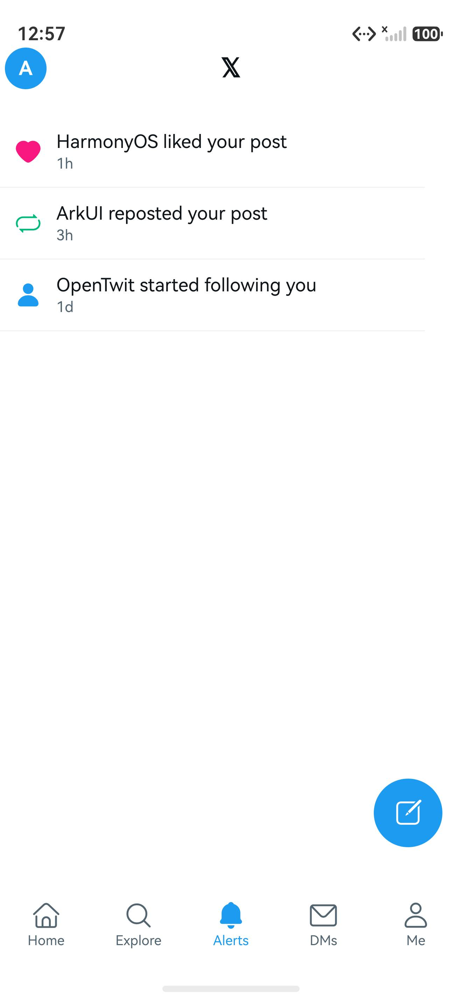
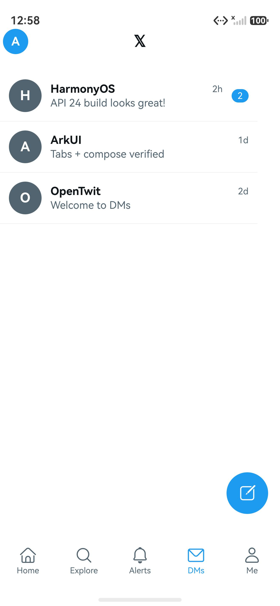
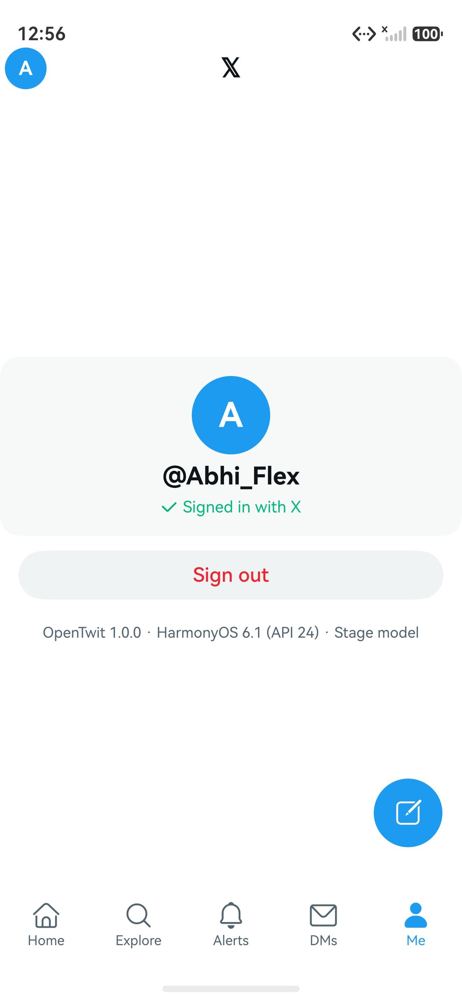

# OpenTwit

Open source X/Twitter client for HarmonyOS devices — native ArkTS, Stage model,
built with the HarmonyOS design language and an iOS-X-inspired layout.

| Home | Explore | Alerts |
|---|---|---|
|  |  |  |

| DMs | Me |
|---|---|
|  |  |

## Features

- **Home timeline** with post rows (reply · repost · like · views), pull-to-refresh,
  and a floating compose button opening a bottom-sheet editor (replies prefill `@handle`)
- **Sign in with X** via OAuth 2.0 PKCE in an embedded browser — the only auth
  method, no keys for users to handle
- **Explore** with search (live search when signed in), **Alerts**, **DMs**,
  and a **Me** tab with profile card and sign-out
- **Works with zero setup**: sample posts show without any key; sign-in unlocks
  live data and interactions, with honest status messages (e.g. X 402 paid-access)
- Phone / tablet / 2in1, Stage model only

## Design

- **HarmonyOS Symbols** throughout (`SymbolGlyph` + `$r('sys.symbol.*')`):
  house, magnifyingglass, bell, envelope, person, ellipsis_bubble, repeat,
  heart, eye, square_and_pencil, checkmark — filled variants for active/liked
  states, all names verified against the system symbol font
- Navigation + bottom Tabs, Search, Refresh, toasts, CustomDialog composer,
  16vp card radii, standard spacing
- System typography (HarmonyOS Sans, never overridden)
- Full **light/dark** adaptation via `base` + `dark` color resources —
  no hardcoded UI colors
- iOS X layout cues: avatar + centered 𝕏 top bar, 4-metric post rows,
  compose FAB

## Tech

- **Target:** HarmonyOS 6.1.1 (API 24); uses only stable Stage-model APIs,
  forward-compatible with HarmonyOS 7 (API 26)
- **Live data:** X API v2 (`reverse_chronological` home timeline, search,
  post/reply, likes, reposts), token persisted via preferences
- **Layout:** `AppScope/` (bundle `com.opentwit.harmony`), `entry/` module —
  `ets/entryability/`, `ets/pages/` (Index, Login, AuthWeb),
  `ets/components/TweetCard`, `ets/models/`, `ets/services/`
  (AuthStore, OAuthConfig, Pkce, XApiClient, MockData)

## Build

Requirements: HarmonyOS Command Line Tools 6.1.1 (or DevEco Studio) with the
HarmonyOS 6.1.1 SDK, JDK 17, and `~/.npmrc` containing
`@ohos:registry=https://repo.harmonyos.com/npm/`.

```bash
export PATH="$HOME/Developer/command-line-tools/bin:/opt/homebrew/opt/openjdk@17/bin:$HOME/Developer/command-line-tools/tool/node/bin:$PATH"
export DEVECO_SDK_HOME="$HOME/Developer/command-line-tools/sdk"
export JAVA_HOME="/opt/homebrew/opt/openjdk@17/libexec/openjdk.jdk/Contents/Home"
ohpm install
hvigorw assembleApp
# outputs:
#   entry/build/default/outputs/default/entry-default-unsigned.hap
#   build/outputs/default/OpenTwit-default-unsigned.app
```

Debug builds are unsigned on purpose (`signingConfigs: []`). For a signed
release, provision materials out-of-band via DevEco Studio
(File > Project Structure > Signing Configs); never commit
`.p12` / `.cer` / provisioning profiles.

## Enabling live sign-in (one time, ~2 min)

OAuth requires a registered client (there is no anonymous X API), but end
users never touch it — only the builder, once:

1. Create a free app at https://developer.x.com (Projects & Apps).
2. Enable OAuth 2.0, choose **Native App**, and add the callback URL exactly:
   `opentwit://callback`.
3. Paste the Client ID into `X_CLIENT_ID` in
   `entry/src/main/ets/services/OAuthConfig.ets` and rebuild.
   No client secret is needed (PKCE public-client flow).

Note: X meters timeline/search reads (HTTP 402 without paid access); the app
reports this in the status line instead of failing silently.

## License

Apache-2.0 — see [LICENSE](LICENSE).
