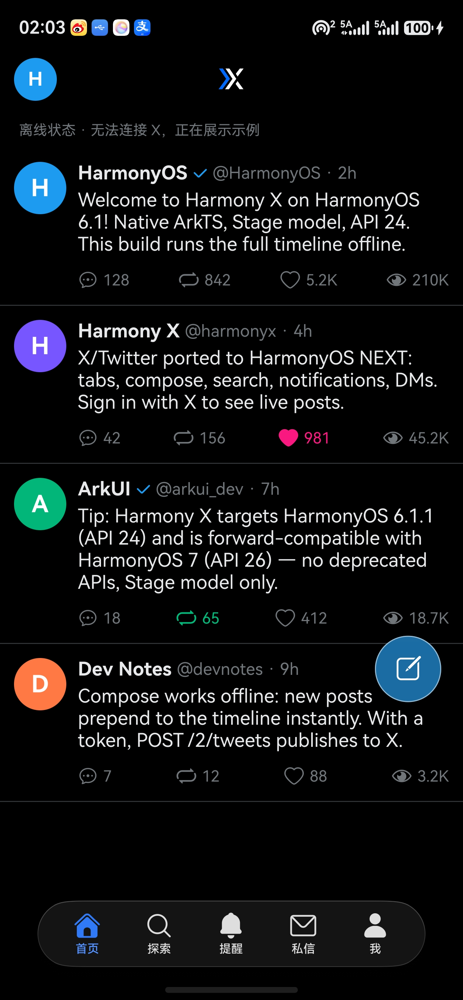
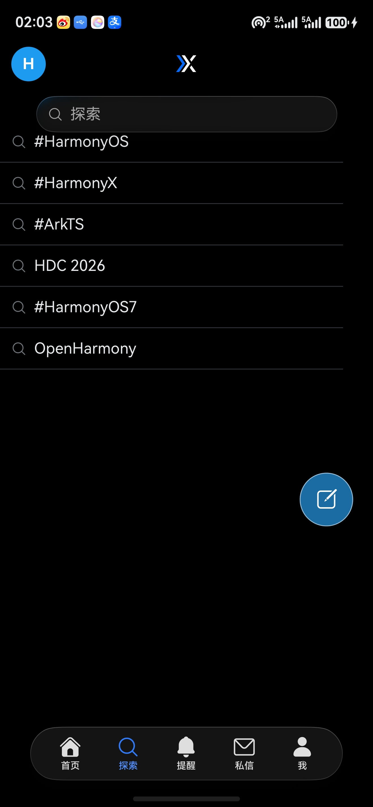
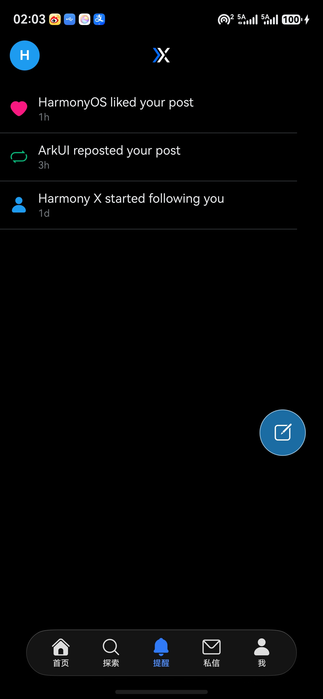
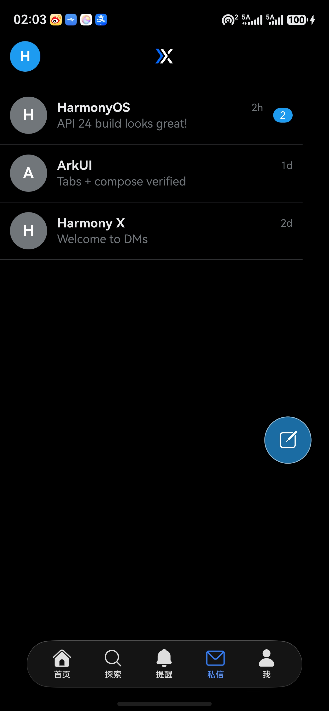
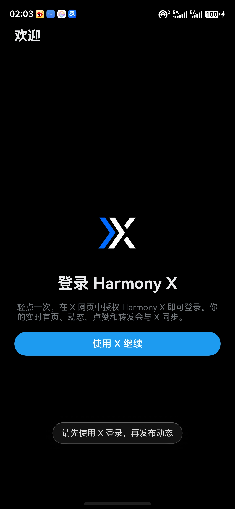
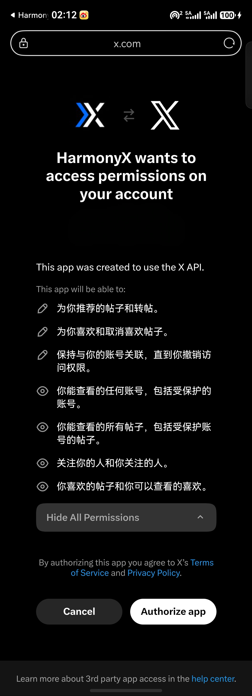

<p align="center">
  
</p>

<h1 align="center">Harmony X</h1>

<p align="center">
  A native, design-led X client for HarmonyOS.<br>
  Built with ArkTS and the Stage model — focused on a clean, dark, device-native experience.
</p>

<p align="center">
  
  
  
</p>

<p align="center">
  <a href="#highlights">Highlights</a> ·
  <a href="#screens">Screens</a> ·
  <a href="#changes-from-opentwit">Changes from OpenTwit</a> ·
  <a href="#build">Build</a> ·
  <a href="#upstream--license">Upstream &amp; License</a>
</p>

---

## Highlights

| | |
|:--|:--|
| **A complete social shell** | Home timeline, Explore, Alerts, messages, profile and a floating composer — with sample content ready before sign-in. |
| **Native HarmonyOS design** | ArkUI layout, HarmonyOS Symbols, adaptive light/dark colors, and phone / tablet / 2-in-1 support. |
| **Real X when configured** | OAuth 2.0 PKCE in the system browser; sign-in unlocks live timeline, search, posting, likes and reposts. |
| **Honest offline behavior** | When X is unavailable or API access is limited, the app stays usable and explains the current state clearly. |

## Screens

<p align="center">
  
  
  
  
</p>

<p align="center"><sub>Home · Explore · Alerts · Messages</sub></p>

<p align="center">
  
  
</p>

<p align="center"><sub>Harmony X sign-in · X.com authorization in the system browser</sub></p>

## Design notes

- **Actual app icon** — the header uses `AppScope/resources/base/media/app_icon.png`; the installed app uses its paired layered resources (opaque black background plus transparent blue/white foreground mark), all at 1024 × 1024.
- **System-first interface** — HarmonyOS Sans and system SymbolGlyph icons, with color tokens in resources rather than hard-coded page colors.
- **Responsive by default** — designed for phone, tablet and 2-in-1 device types using the Stage model.

## Changes from OpenTwit

Harmony X is not a reskin: it is an API 26-oriented HarmonyOS adaptation of
OpenTwit with the following project-specific changes.

- **Immersive HDS tabs** — replaces the conventional bottom bar with `HdsTabs`,
  adaptive immersive material and scroller binding for the five primary feeds.
- **Immersive HDS navigation** — uses `HdsNavigation` with an immersive
  gradient-blur title treatment, while keeping the avatar and brand mark within
  the navigation content.
- **Intelligent compose button** — a full-page draggable HDS compose action
  listens for holding-hand changes when supported, remembers the last usable
  side otherwise, and follows the device's safe-area and tab-bar insets.
- **Point-light interaction** — press and drag activate HDS point lighting to
  illuminate the component border and content; the compose action also scales
  during a drag for clear tactile feedback.
- **Fullscreen window handling** — `EntryAbility` enables layout fullscreen and
  observes system and navigation-indicator avoid areas so immersive content
  remains usable around device cutouts and gesture indicators.
- **Chinese localization** — product naming, interface copy and status messages
  are localized in `zh_CN`, with matching English resources and a Chinese base
  resource set.
- **Harmony X identity and sign-in** — new package identity, layered app icon,
  system-browser OAuth callback flow, dark visual system and documentation.

## Project configuration

| Setting | Current value |
|:--|:--|
| Application | `Harmony X` · `com.haohaoai0.harmonyx` · version `1.0.0` (`versionCode` 1) |
| Module | `entry` · Stage model · `modelVersion` 5.0.0 |
| SDK profile | No explicit compile SDK (uses the installed DevEco SDK) · compatible SDK `6.1.0 (API 23)` · target SDK `26.0.0` |
| Devices | `phone`, `tablet`, `2in1` · fullscreen `EntryAbility` |
| Permissions | `ohos.permission.INTERNET`, `ohos.permission.DETECT_GESTURE` |
| Build tooling | Hvigor `6.26.4` · `@ohos/hvigor-ohos-plugin` `6.26.4` · `@ohos/hypium` `1.0.19` (dev dependency) |

## Build

Requirements: HarmonyOS Command Line Tools (or DevEco Studio), JDK 17, and an
npm configuration containing:

```ini
@ohos:registry=https://repo.harmonyos.com/npm/
```

```bash
devecocli build
```

Outputs:

```text
entry/build/default/outputs/default/entry-default-unsigned.hap
```

The open-source `build-profile.json5` intentionally contains no signing
materials. Configure certificate, profile and passwords only in your local
DevEco Studio signing configuration; never commit them.

## Enable X sign-in

1. Create an application at [developer.x.com](https://developer.x.com/).
2. Enable **OAuth 2.0** as a **Native App** and set the callback URL to `harmonyx://callback`.
3. Add the Client ID to `entry/src/main/ets/services/OAuthConfig.ets`, then rebuild.

Harmony X uses PKCE, so no client secret is required. Tapping **Continue with
X** launches the system browser with `ohos.want.action.viewData`; the X.com
permission page shown above is therefore rendered and owned by X, rather than
being imitated inside the app. Some X endpoints require paid API access; the
app reports that condition and continues with sample content.

## Upstream & License

Harmony X is a derivative work of
[OpenTwit](https://github.com/Abhi-Flex1/OpenTwit) by Abhi-Flex1. This Fork
keeps the Apache-2.0 license and the repository's applicable attribution notices;
Harmony X-specific changes include the application identity, visual system,
localized interface, OAuth flow, responsive UI refinements and documentation.

Licensed under [Apache-2.0](LICENSE).
